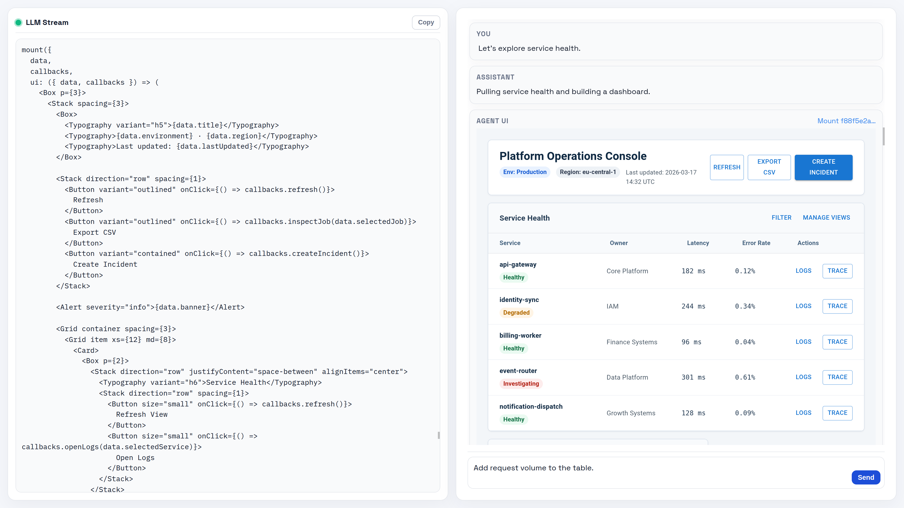

# fenced

A prototype of an agentic chat runtime where markdown is the protocol. The LLM streams markdown text, executes TypeScript code blocks server-side, and renders reactive UI components on the client—all within a single response.

> **Thesis:** Markdown is the ideal protocol for agentic AI assistants. It's what LLMs already understand, mixing prose, executable code, and structured data in a format that requires no new training.

📖 **Read the accompanying article:** [The Future of Agentic AI Assistants Is... Markdown](https://fabian-kuebler.com/posts/agentic-ai-markdown/)



## Quick Start with Docker

```bash
# Build the image
docker build -t fenced .

# Run with required environment variables
docker run -p 4000:4000 \
  -e OPENAI_API_KEY=your-openai-api-key \
  -e FENCED_DISABLE_GOOGLE_SKILLS=true \
  fenced
```

Open http://localhost:4000 in your browser.

### Environment Variables

| Variable | Required | Description |
|----------|----------|-------------|
| `OPENAI_API_KEY` | Yes | OpenAI API key for LLM generation |
| `FENCED_DISABLE_GOOGLE_SKILLS` | No | Set to `1` to disable Google skills (mail, contacts, calendar). Recommended when running without Google OAuth credentials. |

## Local Development

### Prerequisites

- [Bun](https://bun.sh) >= 1.0

### Setup

```bash
# Install dependencies
bun install

# Create .env file
cp .env.example .env
# Edit .env with your OPENAI_API_KEY

# Run dev servers (two terminals)
bun run dev:server   # Bun API on port 4000
bun run dev:client   # Vite dev server with HMR

# Or use tmux to run both
bun run dev
```

### Google Skills (Mail, Calendar, Contacts)

The mail, calendar, and contacts skills need Google OAuth credentials. Without them, set `FENCED_DISABLE_GOOGLE_SKILLS=true` in your `.env` to skip loading these skills.

<details>
<summary>Setting up Google OAuth credentials</summary>

**1. Create OAuth credentials:**

1. Go to [Google Cloud Console](https://console.cloud.google.com/)
2. Create a project (or select an existing one)
3. Enable the **Gmail API**, **Google Calendar API**, and **People API**
4. Configure the **OAuth consent screen** (External, add your email as test user)
5. Under **Credentials → Data Access**, add these scopes:
   - `https://www.googleapis.com/auth/gmail.modify`
   - `https://www.googleapis.com/auth/calendar`
   - `https://www.googleapis.com/auth/contacts`
6. Go to **Credentials** → **Create Credentials** → **OAuth client ID**
7. Choose **Desktop app** as the application type
8. Download the JSON and save it as:
   ```
   packages/skills/src/google-auth/client_secret.json
   ```

**2. Generate access token:**

```bash
bun run google:renew-token
```

This starts a local server on port 3000, opens your browser for OAuth consent, and saves the token to `token.json`.

**3. Verify it works:**

```bash
bun run google:test-auth
```

**4. Done.** The agent can now use `gmail`, `calendar`, and `contacts` globals in `agent.run` blocks.

> **Warning:** The agent can read/send emails and read/modify your calendar. Contacts are read-only.

</details>

## The Protocol

Three block types flow through the system:

| Block | Syntax | Purpose |
|-------|--------|---------|
| **Text** | Standard markdown | Streams to user token-by-token |
| **Code** | ` ```tsx agent.run ` | Server-executed TypeScript with persistent context |
| **Data** | ` ```json agent.data => "id" ` | JSON streamed into named client targets |

The feedback loop: user message → LLM generates markdown → code executes → `console.log` output feeds back to LLM → repeat until logs are empty.

## Generative UI

The `mount()` primitive lets agents write React components on the fly:

```tsx
const data = new Data({ progress: 0 });
const comp = mount({
  data,
  outputSchema: z.object({ name: z.string() }),
  ui: ({ data, output }) => (
    <Card>
      <LinearProgress value={data.progress} />
      <TextField {...output.name} label="Name" />
      <Button type="submit" {...output}>Submit</Button>
    </Card>
  )
});

data.progress = 50;  // Live update to client
const result = await comp.result;  // Wait for form submit
```

Four data-movement patterns:

- **Client → Server:** Form submission with Zod validation
- **Server → Client:** Live updates via Valtio proxy mutations
- **LLM → Client:** `json agent.data` blocks stream JSON incrementally
- **Client → Server:** Callbacks for interactive elements

## Project Structure

```
apps/
  client/     # React + Vite frontend
  server/     # Bun HTTP/WebSocket API
packages/
  shared/     # Protocol types, constants
  channel/    # WebSocket transport layer
  session/    # Session model
  runtime/    # Interaction loop orchestration
  llm/        # LLM streaming (Vercel AI SDK)
  parser/     # Streaming markdown parser
  executor/   # VM execution, mount manager
  skills/     # Skill discovery and injection
  component-render/  # Client-side UI rendering
```

## Scripts

```bash
bun run dev:client      # Vite dev server
bun run dev:server      # Bun API with hot reload
bun run build           # Build client for production
bun run lint            # ESLint (client) + tsc (server)
bun test                # Run all tests
bun test packages/parser  # Run tests in specific package
```

## Adding Skills

Skills extend agent capabilities. Each skill lives in `packages/skills/src/skills/<name>/`:

| File | Purpose |
|------|---------|
| `SKILL.md` | Description injected into LLM prompt |
| `index.d.ts` | TypeScript declarations shown to model |
| `index.ts` | Runtime implementation (globals in `agent.run`) |

## Security

This is a developer prototype with **no sandboxing**. The LLM generates code that executes with full Bun/browser capabilities. Treat it as "RCE as a Service" until proper isolation is implemented.

## Documentation

- [SPEC.md](./SPEC.md) — Full specification

## Notes

- Single-session, single-user prototype
- All code runs in one `node:vm` context per session (variables persist)
- API on port 4000, Vite proxies `/chat` WebSocket
- Max 60s per `agent.run` execution
